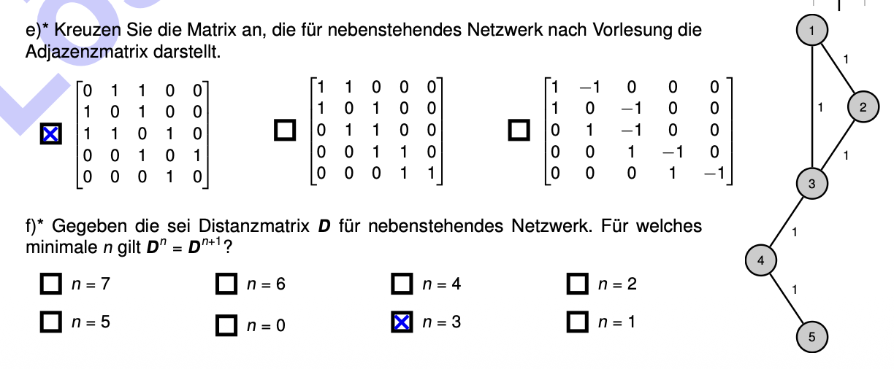

# 知识点复习：Distance Matrix & Distance Vector Routing (距离矩阵与距离向量路由)

## 📌 考频分析 (Testing Frequency)
- **考频评级**：**极高频 (Very High Frequency)**
- **复习建议**：**必考推图/看图题！掌握最短路径跳数的查法，熟记理论对比**
- **试卷覆盖情况**：
  - 几乎每年的**期中考试 (Midterm)** 都会考一道必考看图题（"For which minimal $n$ does $D_n = D_{n+1}$ hold?"）。如 2016, 2019, 2022 年等。
  - 在期末考试中，通常演化为对 **RIP 协议 (Routing Information Protocol)** 和 **Distance Vector vs Link State** 的理论对比与更新表推导（如 2017, 2019 期末考）。

---

## 📚 考点核心与理论深挖 (Topic Overview & Core Concepts)

在 `slides_chap2.pdf` 和 `tutorial08` 中，介绍了表示网络图表的三种矩阵结构：
1. **Adjacency matrix (邻接矩阵)**：仅表示节点是否直接相连（0 或 1）。
2. **Distance matrix (距离矩阵 $D$)**：表示相邻节点的直接链路成本 (Link cost)。
3. **$D_n$ 的含义 (Min-plus product)**：将 $D$ 矩阵进行自身乘法迭代。$D_2$ 包含了通过最多 2 条边 (2 hops) 的最短路径成本。$D_n$ 包含了通过最多 $n$ 条边的最短路径成本。

### 核心考点：什么时候 $D_n = D_{n+1}$？
当 $D_n$ 矩阵内的最短路径不再随着迭代次数增大而改变时，意味着**网络中任意两点之间的最短路径都已经找到了**。
在这个考点里有一个**核心法则**：
> "The power $n$ such that $D_n = D_{n+1}$ is determined by the **longest shortest path** in the network (in terms of edges/hops)."
> （使得 $D_n = D_{n+1}$ 成立的最小 $n$ 值，等于这个网络拓扑中，**节点之间最短路径中，包含边数（跳数）最多的那一条路径的边数**。）

### Distance Vector Routing (距离向量路由, 例如 RIP)
- **核心算法**：分布式 **Bellman-Ford** 算法。
- **工作原理**：路由器**不知道完整的网络拓扑结构**（no complete topology），它们只知道自己的直接邻居。它们定期将自己到达各目的地的距离表 (Distance Vector) 发送给邻居。
- **RIP 考点**：使用 **Hop Count** (跳数) 作为度量。最大有效跳数是 15 (16 代表不可达/无穷大)。如果在更新时某个链路断了，容易产生 **Count to infinity (计数到无穷大)** 的经典问题。

---

## 🎯 考法分析与历年真题 (Past Questions & Answers)

### 题型 1：看图数跳数 (The Matrix Convergence Calculation)
**Question:** Given is the distance matrix $D$ for the network next to it. For which minimal $n$ does $D_n = D_{n+1}$ hold?
*(题目往往配有一张由若干个节点 ABCDE 连接起来的网络图)*
**Answer:** *(例如 $n=4$, $n=2$ 等)*
📍 **出处 (Source):** *[midterm_2019_en.md, Task 1f; midterm_2022_en.md, Task 1g]*

💡 **中文解析与解题技巧 (绝杀技):**
遇到这道题，**绝对不要**去傻算矩阵乘法！
1. 直接看图。
2. 找出图中**相隔距离最远**的两个点（注意，是指它们之间的**==最短路径==**，不是绕远路）。
3. 数一数这两个点之间的**==最短路径==包含了几条边 (多少个 Hop)**。
4. 这个**边数（跳数）**就是答案的最小值 $n$！
*(考试时直接看图数最远两点的最短边数即可秒杀。)*

---

### 题型 2：Distance Vector 理论与算法 (The Protocol Foundation)
**Question:** What algorithm is used for Distance Vector Routing?
**Answer:** A distributed (decentralized) implementation of the **Bellman-Ford** algorithm.
📍 **出处 (Source):** *[tutorial08-solution.pdf & retake_2022_en.md]*

**Question:** RIP is a distance vector protocol. What two components does an update contain that a RIP router regularly sends? What essential information is NOT contained?
**Answer:** 
- Contains: Destination and cost to the destination.
- Not contained: Which next hop is required to reach the respective destination (or the complete network topology).
📍 **出处 (Source):** *[retake_2019-solution_en.md, Task 2d & 2e]*

💡 **中文解析:** 
必须记住它和 Link State (如 OSPF 用的 Dijkstra 算法) 的区别。Distance Vector (RIP, Bellman-Ford) 就像是“口口相传”式的寻路，它只告诉邻居“我去 X 地点要 5 块钱”，但**绝不会告诉邻居具体的行走路线或者下一跳是谁**（不包含 Next Hop，没有全网拓扑）。

---

### 题型 3：RIP 的局限性与 Count to Infinity (路由环路问题)
**Question:** To what extent are networks whose routers exclusively use RIP as a routing protocol limited in size?
**Answer:** The hop count of 15 is interpreted as the maximum. A hop count of 16 means unreachable/infinity. So the network diameter is limited.
📍 **出处 (Source):** *[retake_2019-solution_en.md, Task 2c]*

**Question (拓展):** In case of a route failure, what issue occurs in RIP?
**Answer:** "Count to infinity" problem. (Routers keep incrementing the cost back and forth until it reaches 16).
📍 **出处 (Source):** *[retake_2021-solution_en.md, Task 1e]*

💡 **中文解析**: 这也是必考概念。RIP 最大跳数是 15，所以稍微过大一点的网就跑不了 RIP。同时因为“盲人摸象”的工作原理，断网时容易产生“你依赖我，我依赖你”的死循环累加（Count to infinity）。

---

### 题型 4：Distance Vector 表格推导与 Count-to-Infinity 应对机制 (Countermeasures)
*(⚠️ 补充说明：之前的大纲主要侧重期中期末真题，而这张表格推导大题其实是 `[tutorial08-solution.pdf, Problem 3]` 的核心作业题。在此为你补全！)*

**Question 4a & 4c (Tutorial 08 原题重现):** 给定一个由 A, B, C, D 四个路由器组成的网络：线缆成本为 A-B(2), A-C(1), B-C(4), C-D(1)。填写路由器在互相交换更新时的 Distance Vector 表格。之后断开 C-D 的连接，演示 Count-to-Infinity 是如何发生的。

**Step-by-Step 极简解法与表格推导：**
我们用 `(Cost, Next Hop)` 的格式存表 `[(去A), (去B), (去C), (去D)]`。

**阶段一：初始化 (Step 0)**
大家只认识自己，到达自己的成本为 0，其他全是未知 `(/,/)`。
- Router A: `[ (0,A), (/,/), (/,/), (/,/) ]`
- Router C: `[ (/,/), (/,/), (0,C), (/,/) ]`

**阶段二：第一次交换 (Step 1)**
大家把自己的表发给**直接相连的邻居**。A 收到了 B 和 C 的表，发现走 B 需要 2，走 C 需要 1。
- Router A: `[ (0,A), (2,B), (1,C), (/,/) ]` 
- Router C: `[ (1,A), (4,B), (0,C), (1,D) ]` (C直接连着A,B,D)

**阶段三：收敛 (Step 2)**
再次交换！此时 A 从 C 的表里看到了“C 能到 D，成本是 1”。那么 A 去 D 的总成本 = A去C的成本(1) + C去D的成本(1) = 2。下一跳写 C。
- Router A: `[ (0,A), (2,B), (1,C), (2,C) ]` 
*(网内所有路由器都在 3 步之内获得了全局最短路径记录)*

---
**💥 灾难发生：C - D 链路断开 (Count-to-Infinity 触发过程)**

1. **Step 4 (感知断网)**：C 和 D 发现线断了。C 把去 D 的成本设为无穷大。
   - Router C: `[ (1,A), (3,A), (0,C), (无穷大) ]`
2. **Step 5 (欺骗与循环加价)**：重点来了！C 在下一次接受更新时，收到了 A 发来的表。A 的表中得意地写着：“我能去D，成本只要2！”（A 的旧表：`(2,C)`）。
   - C 像抓住救命稻草一样，认为 A 真的有路去 D。C 决定：我要去 D 就先去 A。
   - **C 的新表：去 D 成本 = C去A的成本(1) + A去D的成本(2) = `3`。下一跳写去 A。**
   - Router C 去 D 更新为：`(3,A)`。
3. **Step 6 (再次欺骗)**：A 收到了 C 的新表（C说去D要3）。A 想：“我原来去D是靠C走捷径(只需1)，现在C涨价到3了，那我的总成本也得跟着涨！”
   - A 更新自己去 D 的成本 = A去C的成本(1) + C去D的新成本(3) = `4`。下一跳还是 C。
   - Router A 去 D 更新为：`(4,C)`。
4. **结局 (Step 7, 8, 9...)**：
   - C 收到了 A(4)，涨价到 `5`。A 收到了 C(5)，涨价到 `6`。
   - **两个路由器互相拿对方（其实归根结底是自己残存的废弃数据）作为跳板，相互把去 D 的价格+1 往上抬。** 直到价格达到 **16** （定义上的无穷大/不可达），它们才会停止。这就是经典的 **Count-to-Infinity**。

**Question 4d:** Explain how **Split Horizon**, **Triggered Updates**, and **Path Vector** work as countermeasures for the count-to-infinity problem.
**Answer:**
1. **Split Horizon (水平分割 / “不走回头路”)**:
   - "Do not advertise a route over the interface over which the route was originally learned." 
   - *（简单来说：如果我从节点 C 那里学到了去 D 的路，我就绝对不会再向 C 反向广播我怎么去 D。这就防止了两个节点互相欺骗。）*
2. **Triggered Update (触发更新 / “立刻通知”)**:
   - Instead of sending routing updates only at periodic intervals (e.g., 30s), updates are **sent immediately** when topology changes are detected.
   - *（虽然不能根本解决死循环，但能极大加速“数到 16” 的过程，减少错误路由存活的时间。）*
3. **Path Vector (路径向量 / “记下足迹”)**:
   - Remember where an update came from and include the full path list. If a router discovers itself in this path, it knows a loop is present and discards the update. (Used by **BGP**).
   - *（这就是 Distance Vector 的究极进化版 BGP，把沿途走过的所有节点都记下来，一看清单上有自己，立马丢弃更新，从根源断绝环路。）*
📍 **出处 (Source):** *[tutorial08-solution.pdf, Task 3d]*
